# Scheduling Deep Dive: How KAI Scheduler Concepts Interact

This guide explains how KAI Scheduler's core concepts — [queues](../queues/README.md), [priorities](../priority/README.md), [fairness](../fairness/README.md), [preemption](../priority/README.md#preemptibility), [reclaim](../fairness/README.md#reclaim-resources), and [shards](../operator/scheduling-shards.md) — work together to make scheduling decisions. Each concept has its own reference documentation; this guide focuses on **how they interact**.

## Table of Contents
- [Overview](#overview)
- [Queue Priority](#queue-priority)
- [Workload Priority](#workload-priority)
- [Resource Allocation: Deep Dive](#resource-allocation-deep-dive)
- [Reclaim: Between Queues](#reclaim-between-queues)
- [Common Scenarios & FAQ](#common-scenarios--faq)
- [Scheduling Shards](#scheduling-shards)
- [The Scheduling Cycle](#the-scheduling-cycle)
- [Related Documentation](#related-documentation)

## Overview

KAI Scheduler manages cluster resources through a hierarchy of queues that can stand for an organizational structure such as departments with teams or departments with projects. Each queue has a **guaranteed quota** (deserved resources) and may receive **over-quota surplus** when the cluster has spare capacity.

Two independent priority systems control different aspects of scheduling:

| System | Scope | Controls |
|--------|-------|----------|
| **Queue Priority** | Between queues | Over-quota surplus distribution order |
| **Workload Priority** | Within a single queue | Scheduling order and preemption eligibility |

The scheduler executes a pipeline of actions each cycle — allocating workloads to free resources, consolidating fragmented placements, and enforcing resource guarantees (see [The Scheduling Cycle](#the-scheduling-cycle)). The enforcement side uses two distinct mechanisms:
- **Preemption** operates **within a queue** — higher-priority workloads evict lower-priority preemptible workloads in the same queue
- **Reclaim** operates **between queues** — under-quota queues recover resources from over-quota queues

The key guarantee: **in-quota resources are always protected**. A queue using resources within its guaranteed quota will never have those resources reclaimed by another queue.

## Queue Priority

The `priority` field on a queue controls how resources are distributed **between sibling queues**. It operates in two phases:

1. **Guaranteed quota (in-quota)** — each queue receives its deserved resources regardless of priority. All queues are treated equally at this stage.
2. **Surplus distribution (over-quota)** — remaining resources after all quotas are satisfied are distributed by priority. Higher-priority queues receive surplus **before** lower-priority queues.

Within the same priority level, `OverQuotaWeight` controls the proportional split of surplus resources.

The following diagram shows a 10-GPU cluster shared by three queues. In the first phase, each queue receives its guaranteed quota simultaneously — priority plays no role. In the second phase, the 3 surplus GPUs are distributed to the highest-priority queues first, split by weight (2:1) between the Vision Team and LLM Team queues:

<picture>
  <source media="(prefers-color-scheme: dark)" srcset="diagrams/queue-priority-dark.svg">
  <source media="(prefers-color-scheme: light)" srcset="diagrams/queue-priority-light.svg">
  
</picture>

### Key Points

- Queue priority **does not** affect guaranteed quota allocation
- Priority creates "buckets" — all surplus goes to the highest-priority bucket before any reaches the next
- A queue with **priority=2, weight=1** gets surplus before a queue with **priority=1, weight=100** — priority overrides weight
- `OverQuotaWeight` only matters when comparing queues at the **same** priority level

## Workload Priority

The `priorityClassName` on a workload controls scheduling behavior **within a single queue**:

1. **Scheduling order** — higher-priority workloads are scheduled first
2. **Preemptibility** — by default, priority < 100 is preemptible, priority >= 100 is non-preemptible
3. **Preemption** — higher-priority workloads can evict lower-priority preemptible workloads in the **same queue**

The following diagram shows the Vision Team's queue with a train (pri: 50) and build (pri: 100) workload already running on the GPUs. Two train workloads are submitted but cannot be scheduled — no free GPUs and they cannot preempt workloads with equal or higher priority. When an inference workload (pri: 125) is submitted third, it jumps to the front of the queue and preempts the running train to take its GPU:

<picture>
  <source media="(prefers-color-scheme: dark)" srcset="diagrams/workload-preemption-dark.svg">
  <source media="(prefers-color-scheme: light)" srcset="diagrams/workload-preemption-light.svg">
  
</picture>

### Preemption Rules

For preemption to occur, **all** of these must be true:
1. The preemptor and victim are in the **same queue**
2. The victim is **preemptible** (priority < 100 by default)
3. The victim has **strictly lower priority** than the preemptor
4. The victim has at least one actively running pod

### What Preemption Cannot Do

- **Cross queue boundaries** — a workload in Queue-A can never preempt a workload in Queue-B through the preempt action
- **Evict non-preemptible workloads** — workloads with priority >= 100 are immune to preemption
- **Evict workloads with equal or higher priority** — the preemptor must have strictly higher priority

### Queue Priority vs Workload Priority

These are two completely independent systems:

| Aspect | Queue Priority | Workload Priority |
|--------|---------------|-------------------|
| Set on | Queue resource | PodGroup |
| Scope | Between queues | Within a single queue |
| Affects guaranteed quota? | No | No |
| Affects over-quota distribution? | Yes — order between queues | No |
| Affects preemption? | No | Yes — determines victims |
| Affects reclaim? | Indirectly (via fair-share) | No |

## Resource Allocation: Deep Dive

Resource allocation happens in two phases during each scheduling cycle. This section provides details behind the [Queue Priority](#queue-priority) section above.

### Phase 1: Guaranteed Quota (In-Quota)

Each queue receives `min(deserved_quota, requested_resources)`. Queue priority is **irrelevant** at this stage — all queues get their guaranteed resources simultaneously.

### Phase 2: Surplus Distribution (Over-Quota)

Remaining resources after all quotas are satisfied are distributed by priority buckets:
1. Queues are grouped by priority (highest first)
2. Each priority bucket is fully served before moving to the next
3. Within a bucket, resources are split proportionally by `OverQuotaWeight`

### Non-Preemptible Workload Constraints

**Non-preemptible workloads cannot use over-quota resources.** A non-preemptible workload that doesn't fit within its queue's guaranteed quota will remain pending — it will never borrow surplus capacity. This means:
- It will **not** go over-quota
- It will **not** trigger reclaim from other queues
- It **can** trigger preemption of lower-priority preemptible workloads in its **own queue** to free up in-quota capacity

## Reclaim: Between Queues

Reclaim recovers resources **across different queues** to enforce fair-share allocation. It is the only mechanism that moves resources between queues.

### Rules

For reclaim to occur:
1. The reclaimer and victim are in **different queues**
2. The victim is **preemptible**
3. The reclaiming queue is **below its fair-share or deserved quota**
4. The victim's queue is **above its fair-share or deserved quota** (i.e., using over-quota resources)

### The Quota Protection Guarantee

**In-quota resources are always protected from reclamation.** The scheduler enforces two strategies:
- **MaintainFairShare**: the victim's queue must be above its allocatable fair-share
- **GuaranteeDeservedQuota**: the reclaimer must be under its deserved quota, AND the victim's queue must be over its deserved quota

This means a queue using only its guaranteed resources will **never** have workloads reclaimed, regardless of what other queues need.

### What Reclaim Cannot Do

- **Target workloads in the same queue** — use preemption for intra-queue priority enforcement
- **Evict non-preemptible workloads** — non-preemptible workloads are filtered out entirely from the reclaim victim pool
- **Touch in-quota resources** — if a queue is at or below its deserved quota, its workloads are protected

## Common Scenarios & FAQ

### "Why can't my inference workload in Queue-A preempt training in Queue-B?"

This is the most common question. Here's why:

1. **Preemption is intra-queue only.** The preempt action explicitly checks that the preemptor and victim are in the same queue. Since inference is in Queue-A and training is in Queue-B, preemption cannot apply.

2. **Reclaim is the inter-queue mechanism**, but it has strict rules. For Queue-A to reclaim from Queue-B:
   - Queue-B's training workloads must be **preemptible** (priority < 100). The default `train` priority class (50) is preemptible, so this condition is met.
   - Queue-B must be **over its quota**. If Queue-B is using only its guaranteed resources (at or below quota), reclaim is blocked — the quota guarantee protects it.

3. **If Queue-B is at quota, its resources are protected.** The scheduler's `GuaranteeDeservedQuota` strategy ensures that a queue at or below its deserved quota cannot have resources reclaimed, regardless of what other queues need.

**Bottom line:** If Queue-B's training is running within quota, it is protected. Queue-A's inference workload will remain pending until resources become available through other means (Queue-B's workloads completing, cluster scaling up, or Queue-B going over-quota with preemptible workloads).

### "My queue has higher priority — why isn't it getting more resources?"

Queue priority only affects **surplus distribution**. If all cluster resources are consumed within queues' guaranteed quotas (no surplus exists), queue priority has no effect. The only way to get resources from other queues is through reclaim, which targets over-quota preemptible workloads.

### "What happens when a non-preemptible workload can't fit in-quota?"

It stays pending. Non-preemptible workloads (priority >= 100) can only use in-quota resources. If there isn't enough quota available:
- It will **not** go over-quota
- It will **not** trigger reclaim from other queues for over-quota resources
- It **can** trigger preemption of lower-priority preemptible workloads in its **own queue** to free up in-quota capacity

### "How do OverQuotaWeight and queue Priority interact?"

Priority creates buckets. OverQuotaWeight distributes within a bucket.

- A queue with **priority=2, weight=1** gets surplus before a queue with **priority=1, weight=100**
- Priority is strictly hierarchical — all surplus goes to the highest priority bucket before any reaches the next
- `OverQuotaWeight` only matters when comparing queues at the **same** priority level

## Scheduling Shards

Scheduling shards partition a cluster into independent scheduling domains. Each shard has its own scheduler instance, nodes, queues, and pod groups.

### Key Properties

- **Complete isolation**: queues in different shards have no interaction
- **Independent scheduling**: each shard runs its own scheduling cycle (Allocate, Reclaim, Preempt, etc.)
- **Independent quotas**: a queue's quota in one shard is separate from quotas in another shard
- **No cross-shard preemption or reclaim**: enforcement mechanisms operate only within a shard
- **Label-based partitioning**: nodes, queues, and pod groups are assigned to shards via the `kai.scheduler/node-pool` label

All the rules described in this guide apply **independently within each shard**.

## The Scheduling Cycle

Each scheduling cycle executes these actions in order:

1. **Allocate** — Schedule workloads to available resources. No evictions.
2. **Consolidate** — Repack workloads to reduce fragmentation. Temporary eviction only if the workload can be relocated.
3. **Reclaim** — Inter-queue resource recovery. Evicts over-quota preemptible workloads from other queues.
4. **Preempt** — Intra-queue priority enforcement. Evicts lower-priority preemptible workloads in the same queue.
5. **StaleGangEviction** — Enforce gang scheduling requirements. Evict jobs that violate their minMember count.

This order is intentional: non-disruptive actions run first (allocate, consolidate), and disruptive actions run only when needed (reclaim, preempt).

For implementation details, see [Action Framework](../developer/action-framework.md).
